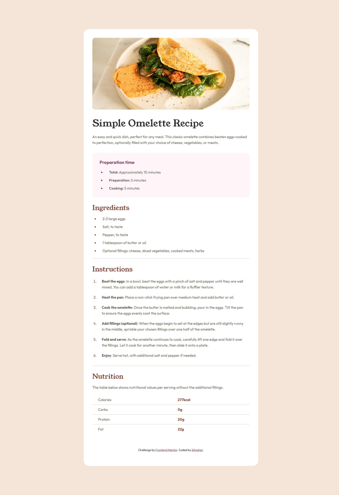

# Frontend Mentor - Recipe page solution

This is a solution to the [Recipe page challenge on Frontend Mentor](https://www.frontendmentor.io/challenges/recipe-page-KiTsR8QQKm). Frontend Mentor challenges help you improve your coding skills by building realistic projects. 

## Table of contents

- [Overview](#overview)
  - [The challenge](#the-challenge)
  - [Screenshot](#screenshot)
  - [Links](#links)
- [My process](#my-process)
  - [Built with](#built-with)
  - [What I learned](#what-i-learned)
  - [Continued development](#continued-development)
- [Author](#author)

## Overview

### Screenshot



### Links

- Solution URL: [Frontendmentor/iliAsghar/recipe-page](https://www.frontendmentor.io/solutions/recipe-page-8D7qKgAabm)
- Live Site URL: [GitHub Pages](https://iliasghar.github.io/Recipe-page/)

## My process

### Built with

- Semantic HTML5 markup
- CSS custom properties
- Flexbox
- Desktop-first workflow

### What I learned

this challange was a harder one of the "newbie" challanges in my opinion.
i had fun setting the typography,and making the page responsive.

in this challange, i tred my best to stick with the BEM naming convention .

```html
<h3 class="nutrition__title">Nutrition</h3>
      <p class="nutrition__text">The table below shows nutritional values per serving without the additional fillings.</p>
      <table class="nutritions__table">
        <tr>
          <td class="nutrition__name">Calories</td>
          <td class="nutrition__amount">277kcal</td>
        </tr>
      ...
      </table>
```

to make the page responsive, i tried not using **Media Queries** ; since in my knowledge, a web page is responsive by default, and it's best to keep it that way and let the browser do the hard work.

these are some of the things i did to make the page responsive : 
- first i set a width 100% and a max-width on the main conrtainer to ensure it fits the width on smaller screen sizes . i also used ```Calc()``` function for my padding and margins to have some whitespace in smaller screens :
```css
.recipe-container {
  ...
  width: 100%;
  max-width: 60rem;
  padding-block:  min(max(0px , calc(100vw - 60rem)) , 3rem);
  margin-block: min(10rem , max(0px , calc( (100vw - 60rem) / 2)));
  ...
  }
```
- i then wrote a ```Media Query``` to change my container's ```border-radius``` and my  ``````'s width:
```css
@media screen and (max-width: 960px){
  .recipe-container {
    border-radius: 0;
  }
  .recipe__img {
    border-radius: 0;
    width: 100vw;
  }
}
```

### Continued development

some of the things that i would love to get better at are designing a responsive layout and increasing my speed of styling a page.

## Author

- Frontend Mentor - [@iliAsghar](https://www.frontendmentor.io/profile/iliAsghar)
- Twitter - [@iliAsghar](https://www.twitter.com/iliAsghar)
- Codepen - [@ili-Asghar](https://codepen.io/ili-Asghar)